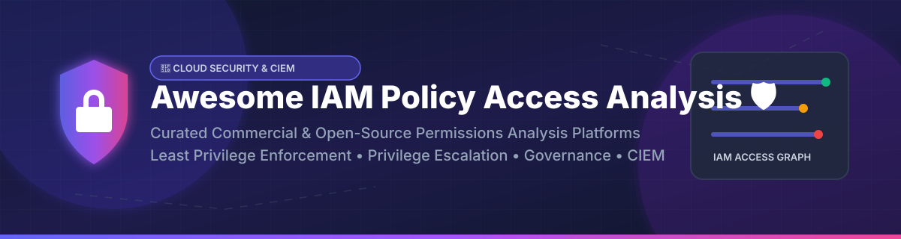

  

  
  
  
  
  

# 🛡️ Awesome IAM Policy & Access Analysis Ecosystem 🔑

> **A curated directory of top Cloud Infrastructure Entitlement Management (CIEM) platforms, IAM policy analyzers, least privilege enforcement engines, and open-source cloud security tools.**

---

## 💡 Overview & SEO Context 🔍

Welcome to the ultimate security guide for **IAM Policy & Access Analysis**! Managing cloud permissions in AWS, Azure, GCP, and SaaS environments is one of the most critical challenges in modern cybersecurity. Excessive permissions, privilege escalation paths, and inactive credentials are leading vectors for cloud security breaches.

This repository tracks notable **commercial CIEM platforms** and **open-source tools** designed to:
- 🕵️‍♂️ **Detect excessive & unused permissions** across multi-cloud environments.
- 📉 **Enforce least privilege access** through automated policy generation and remediation.
- 🕸️ **Analyze attack paths & privilege escalation graph relationships**.
- 📑 **Validate & lint IAM policies** in CI/CD infrastructure-as-code pipelines.

---

## 📑 Table of Contents 📌

- [🏢 SaaS & Commercial Platforms](#-saas--commercial-platforms-)
  - [📊 Market Landscape Analysis](#-market-landscape-analysis-)
- [🔓 Open-Source GitHub Projects](#-open-source-github-projects-)
  - [🔍 IAM Policy Analyzers](#-iam-policy-analyzers)
  - [🛡️ Least Privilege & Policy Generation](#%EF%B8%8F-least-privilege--policy-generation)
  - [🕸️ Attack Path & Graph Analysis](#%EF%B8%8F-attack-path--graph-analysis)
  - [🌟 Sorted Open-Source Repositories Overview](#-sorted-open-source-repositories-overview)
- [🤝 How to Contribute](#-how-to-contribute-)
- [💖 Support & Sponsorship](#-support--sponsorship-)
- [📈 Star History](#-star-history-)
- [⚠️ Disclaimer](#%EF%B8%8F-disclaimer-)

---

## 🏢 SaaS & Commercial Platforms ☁️

### 📊 Market Landscape Analysis 📈
> **Estimated Sector Market Size & Dynamics**: The global **Cloud Infrastructure Entitlement Management (CIEM)** and IAM security market is estimated at **$1.8 Billion to $2.5 Billion (2026)** and is projected to expand at a compound annual growth rate (CAGR) exceeding 25%.  
> **Market Structure**: The market is **moderately fragmented**, transitioning from specialized point-solution startups toward consolidation by broader Cloud-Native Application Protection Platforms (CNAPP) and hyperscalers (e.g., Google's acquisition of Wiz for $32B, SentinelOne's acquisition of PingSafe, Tenable's acquisition of Ermetic). While hyperscalers dominate native cloud environments, multi-cloud entitlement management remains a competitive landscape without a single "winner-take-all" vendor.

| Product / Company | Description | Company Size (Valuation / Revenue / Market Cap) | Starting Price | Free Tier Limit / Free Trial |
| :--- | :--- | :--- | :--- | :--- |
| **[Microsoft Entra Permissions Management](https://www.microsoft.com/en-us/security/business/identity-access/microsoft-entra-permissions-management)** | Microsoft's CIEM solution — permissions analysis across AWS, Azure, and GCP. Best for Microsoft-centric multi-cloud identity. (Retired Nov 2025; migrated to Entra Suite). | **$3.93 Trillion** (Parent Microsoft Market Cap) / **$331.8B** Annual Revenue | **$125.00** per resource per year (Historical standalone rate prior to retirement) | **90-Day Free Trial** (90-day evaluation trial previously offered) |
| **[AWS IAM Access Analyzer](https://aws.amazon.com/iam/access-analyzer/)** | AWS's native IAM analysis service — identifies resources shared with external entities, validates policies, and detects unused access. Best for AWS-native IAM analysis. | **$2.20 Trillion** (Parent Amazon Market Cap) / **$620B+** Annual Revenue | **$0.00** for External Access Analysis; **$0.20** per IAM role/user analyzed per month for Unused Access | **Free Forever** for External Access Findings; **30-Day Free Trial** for Unused Access Analysis |
| **[Palo Alto Prisma Cloud](https://www.paloaltonetworks.com/prisma/cloud)** | Comprehensive CNAPP with CIEM — permissions analysis and least privilege enforcement. Best for large enterprises. | **$325 Billion** (Parent Palo Alto Networks Market Cap) / **$11.48B** Annual Revenue | **$9,000.00** per year (Business Edition for 100 credit tier) | **30-Day Free Trial** (Full evaluation trial upon request) |
| **[Wiz](https://www.wiz.io/)** | CNAPP with CIEM capabilities — graph-based attack path analysis including identity risks. Best for unified cloud security with identity context. | **$32 Billion** (Acquired by Google for $32B) / **$1.0B+** Annual ARR | **$25,000.00** per year (Estimated starting enterprise tier based on workload volume) | **1-on-1 Free Risk Assessment / PoC Trial** upon sales request |
| **[Check Point CloudGuard](https://www.checkpoint.com/)** | Cloud security with CIEM — posture management and entitlement analysis. Best for Check Point ecosystem users. | **$13.48 Billion** (Parent Check Point Market Cap) / **$2.57B** Annual Revenue | **$0.40** per gateway/workload hour (AWS Marketplace PAYG starting rate) | **30-Day Free Trial** (Available via Check Point portal & AWS Marketplace) |
| **[PingSafe](https://www.pingsafe.com/)** | Cloud security with IAM analysis — agentless posture and permissions assessment. Best for cloud security posture. | **$8.81 Billion** (Parent SentinelOne Market Cap; acquired for **$100M**) / **$1.00B** Annual Revenue | **$15,000.00** per year (Integrated within SentinelOne Singularity Cloud Security package) | **14-Day Free Trial / Demo** available via SentinelOne Singularity platform |
| **[Ermetic (Tenable)](https://www.tenable.com/)** | Cloud infrastructure entitlement management (CIEM) platform — agentless analysis of multi-cloud permissions. Best for multi-cloud entitlement management. | **$4.8 Billion** (Parent Tenable Market Cap; acquired Ermetic for **$265M**) / **$850M** Revenue | **$3,000.00** per year (Tenable Cloud Security asset-based starter bundle) | **30-Day Free Trial / Evaluation** upon request |
| **[Orca Security](https://orca.security/)** | Agentless CNAPP with identity analysis — detects excessive permissions and lateral movement paths. Best for agentless cloud security. | **$1.8 Billion** Valuation / **$140M** Estimated ARR | **$15,000.00** per year (Custom workload/asset volume based enterprise tier) | **30-Day Free Trial / Security Risk Assessment** via AWS Marketplace |
| **[Sonrai Security](https://sonrai.com/)** | Cloud permissions and identity management — CIEM with identity graph analysis. Best for cloud identity governance. | **$250 Million** Valuation / **$18.4M** Estimated ARR | **$10,000.00** per year (Enterprise starter tier based on cloud identity count) | **14-Day Free Trial** (Cloud Permissions Firewall free evaluation) |
| **[Britive](https://www.britive.com/)** | Cloud privileged access management — just-in-time access and entitlement management. Best for cloud PAM. | **$100 Million** Valuation / **$9.0M** Estimated ARR | **$12,000.00** per year (Starting enterprise license based on user/identity volume) | **Interactive Demo / Custom Sandbox Trial** upon request |

---

## 🔓 Open-Source GitHub Projects 🛠️

### 🔍 IAM Policy Analyzers

- **[Cloudsplaining](https://github.com/salesforce/cloudsplaining)**   
  **The de facto open-source AWS IAM security assessment tool**, BSD-3-Clause licensed. **Identifies violations of least privilege** in IAM policies and prioritizes them by risk. Scans AWS accounts, users, groups, roles, and generates interactive HTML reports.

- **[PMapper (Principal Mapper)](https://github.com/nccgroup/PMapper)**   
  **AWS IAM privilege escalation & resource exposure visualization**, GPL-3.0 licensed. Creates a graph of IAM principals (users and roles) and their access to AWS resources with offline graph queries.

- **[aws-iam-analyzer](https://github.com/awslabs/aws-iam-analyzer)**   
  **Open-source alternative to AWS IAM Access Analyzer**, Apache-2.0 licensed. Detects resources shared with external entities locally for on-premises environments, private accounts, and Infrastructure-as-Code validation.

- **[Prowler](https://github.com/prowler-cloud/prowler)**   
  **Open-source security assessment, auditing, and hardening tool** for AWS, GCP, Azure, and Kubernetes. Includes comprehensive IAM posture checks and compliance validation.

---

### 🛡️ Least Privilege & Policy Generation

- **[Policy Sentry](https://github.com/salesforce/policy_sentry)**   
  **IAM Least Privilege Policy Generator**, BSD-3-Clause licensed. Creates IAM policies from CloudTrail logs, API call history, or CRUD queries.

- **[Parliament](https://github.com/duo-labs/parliament)**   
  **AWS IAM linting library**, BSD-3-Clause licensed. Offline checking of IAM policies, S3 bucket policies, and SCPs for security flaws and syntax errors.

- **[Custodian (Cloud Custodian)](https://github.com/cloud-custodian/cloud-custodian)**   
  **Rules engine for cloud security, compliance, and governance**, Apache-2.0 licensed. Policy-as-code for AWS, Azure, and GCP with automated enforcement.

- **[iamlive](https://github.com/iann0036/iamlive)**   
  **Generate IAM policies from AWS client calls in real-time** using local HTTP proxy or CSM listening.

---

### 🕸️ Attack Path & Graph Analysis

- **[Cartography](https://github.com/cartography-cncf/cartography)**   
  **Graph-based cloud infrastructure security analysis**, Apache-2.0 licensed. Consolidates infrastructure assets and IAM relationships into a Neo4j graph.

- **[BloodHound](https://github.com/SpecterOps/BloodHound)**   
  **Active Directory & Azure AD (Entra ID) attack path management platform**. Uses graph theory to reveal hidden relationships in identity infrastructure.

- **[Repokid](https://github.com/Netflix/repokid)**   
  **AWS least privilege tool from Netflix**, Apache-2.0 licensed. Automatically removes unused IAM permissions based on Access Advisor data.

- **[IAMSpy](https://github.com/WithSecureLabs/IAMSpy)**   
  **Continuous IAM monitoring & privilege escalation detection tool**, Apache-2.0 licensed. Visualizes access relationships and exports to GraphML/Neo4j.

- **[Aardvark](https://github.com/Netflix/aardvark)**   
  **Netflix multi-account AWS IAM Access Advisor collector** for driving least privilege policy decisions.

- **[CloudTracker](https://github.com/duo-labs/cloudtracker)**   
  **CloudTrail log analyzer** to compare granted permissions against actual usage for over-privileged IAM users.

---

### 🌟 Sorted Open-Source Repositories Overview

The open-source IAM & Cloud Security repositories listed below are **sorted by GitHub Stars_Count (Descending)**:

| Rank | Repository | GitHub_Stars | Category & Focus | License |
| :---: | :--- | :---: | :--- | :--- |
| 1 | **[Prowler](https://github.com/prowler-cloud/prowler)** |  | Multi-cloud security assessment & IAM auditing | Apache-2.0 |
| 2 | **[BloodHound](https://github.com/SpecterOps/BloodHound)** |  | Active Directory & Azure AD identity attack graph | BSD-3-Clause |
| 3 | **[Custodian](https://github.com/cloud-custodian/cloud-custodian)** |  | Multi-cloud governance & policy-as-code | Apache-2.0 |
| 4 | **[Cartography](https://github.com/cartography-cncf/cartography)** |  | Neo4j graph analysis for cloud assets & IAM | Apache-2.0 |
| 5 | **[Cloudsplaining](https://github.com/salesforce/cloudsplaining)** |  | AWS IAM policy risk scoring & prioritization | BSD-3-Clause |
| 6 | **[iamlive](https://github.com/iann0036/iamlive)** |  | Real-time AWS IAM policy generation | MIT |
| 7 | **[Policy Sentry](https://github.com/salesforce/policy_sentry)** |  | CloudTrail-based least-privilege generator | BSD-3-Clause |
| 8 | **[PMapper](https://github.com/nccgroup/PMapper)** |  | AWS IAM privilege escalation graph analysis | GPL-3.0 |
| 9 | **[Parliament](https://github.com/duo-labs/parliament)** |  | AWS IAM policy linter & validator | BSD-3-Clause |
| 10 | **[Repokid](https://github.com/Netflix/repokid)** |  | Netflix automated IAM privilege repoing | Apache-2.0 |
| 11 | **[CloudTracker](https://github.com/duo-labs/cloudtracker)** |  | CloudTrail usage vs IAM permission comparison | BSD-3-Clause |
| 12 | **[aws-iam-analyzer](https://github.com/awslabs/aws-iam-analyzer)** |  | On-prem & IaC IAM Access Analyzer | Apache-2.0 |
| 13 | **[IAMSpy](https://github.com/WithSecureLabs/IAMSpy)** |  | Continuous AWS IAM monitoring & GraphML export | Apache-2.0 |
| 14 | **[Aardvark](https://github.com/Netflix/aardvark)** |  | Netflix multi-account IAM Access Advisor collector | Apache-2.0 |

---

## 🤝 How to Contribute 📝

Contributions are very welcome! To add or update a tool:

1. 🍴 Fork this repository.
2. ✏️ Edit `README.md` following the existing format.
3. 📋 Ensure new entries include tool name, website/repo link, key features, and licensing information.
4. 🚀 Open a Pull Request with a short summary of your addition.

---

## 💖 Support & Sponsorship ☕

If you find this curated ecosystem directory useful, please consider giving it a ⭐ **Star** or sharing it with fellow security engineers and cloud architects!

You can also support the maintainer by buying a coffee or sponsoring future security open-source research:

Thank you for helping us make cloud identity security more transparent, accessible, and least-privilege oriented! 🙌

---

## 📈 Star History 📊

---

## ⚠️ Disclaimer 📜

- This list is **community-curated** for educational and security research purposes only.
- **Credential Safety**: IAM analysis tools require read-only credentials. Never grant write access to analysis tools. Use dedicated service accounts with least-privilege policies for scanning.
- **Continuous Security**: Policy analysis is not a one-time activity. Permissions drift continuously; schedule automated runs in your CI/CD or cloud environment.

---

  <b>Made with ❤️ for security engineers, cloud architects, and DevSecOps practitioners worldwide.</b>

